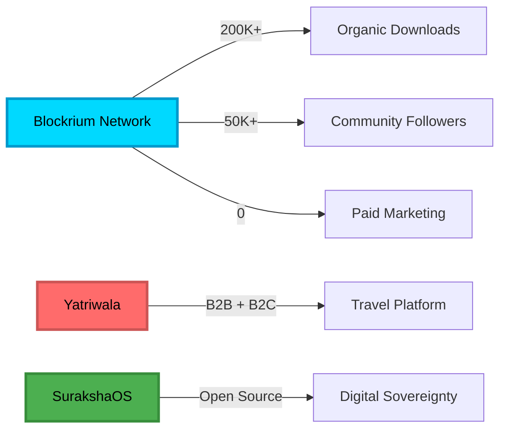
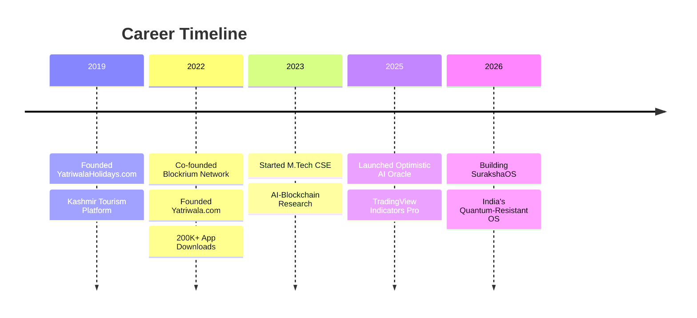
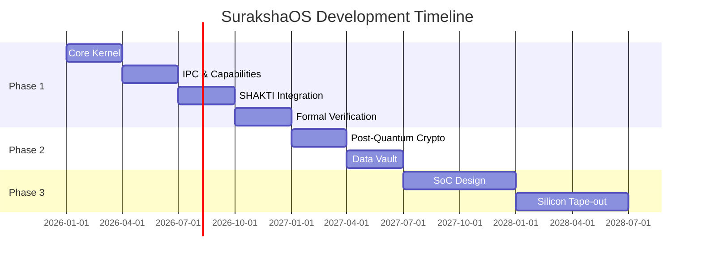
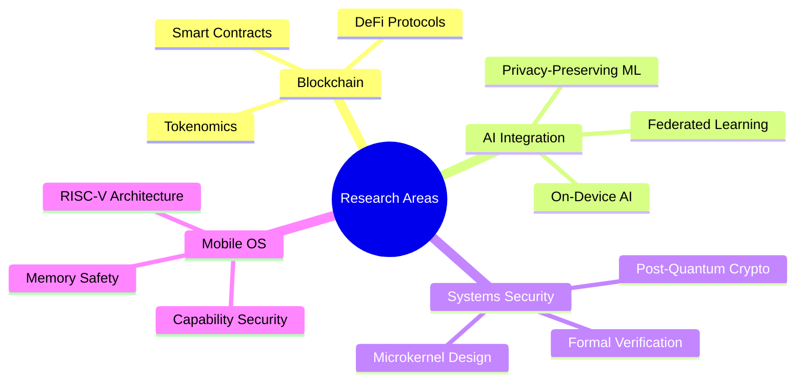
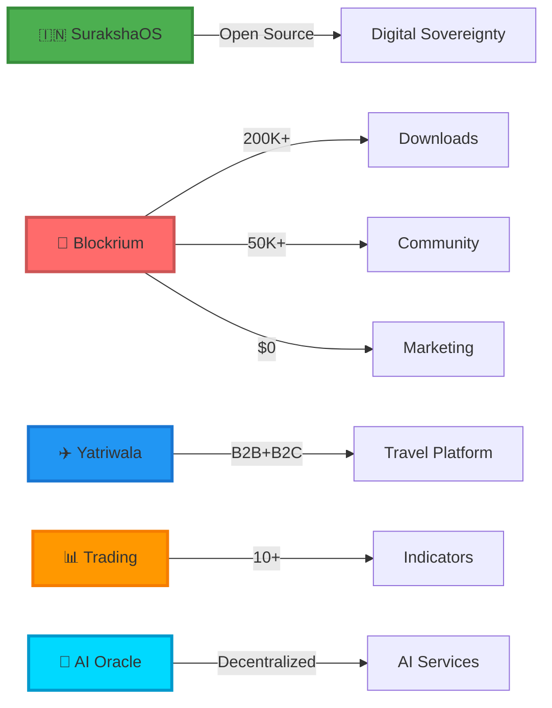
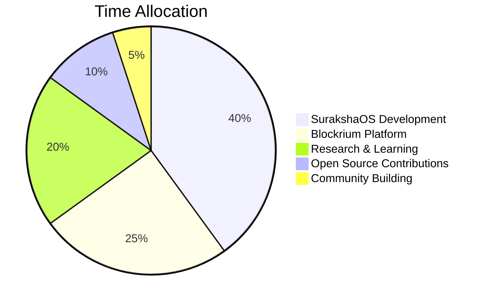

<div align="center">

<!-- Animated Header -->


<!-- Typing SVG -->
<a href="https://git.io/typing-svg"></a>

<br/>

<!-- Social Badges with Hover Effects -->
<p align="center">
  <a href="https://twitter.com/tamheednazeer">
    
  </a>
  <a href="https://linkedin.com/in/tamheednazir">
    
  </a>
  <a href="https://blockrium.com">
    
  </a>
  <a href="mailto:tamheednazir1@gmail.com">
    
  </a>
</p>

<!-- Profile Views Counter -->
<p align="center">
  
  
</p>

</div>

---

<!-- About Me Section with Visual Divider -->


## 🚀 About Me

<table>
<tr>
<td width="50%">

### 👨‍💻 Professional Summary

I'm a **product-focused Web3 and technology leader** with experience building and scaling consumer and B2B platforms across:

- 🔐 **Blockchain & Web3**
- 🦀 **Systems Programming (Rust)**
- 🤖 **AI & Machine Learning**
- 📊 **Trading Systems**
- ✈️ **Travel-Tech**

</td>
<td width="50%">

### 🎯 Current Mission

Building **SurakshaOS** - India's first hyper-secure, data-sovereign mobile operating system with:

- ✅ Formally verified microkernel
- ✅ Post-quantum cryptography
- ✅ RISC-V SHAKTI processors
- ✅ 100% Rust implementation
- ✅ On-device AI

</td>
</tr>
</table>

### 📊 Impact Metrics

<div align="center">



</div>

---


## 💼 Professional Journey

<div align="center">



</div>

### 🔷 Blockrium Network | *Jan 2022 - Present*
**Co-founder & Platform / Product Lead (Web3 & AI)**

<details>
<summary>📈 <b>Key Achievements & Responsibilities</b></summary>

<br/>

```
┌─────────────────────────────────────────────────────────────┐
│                    BLOCKRIUM ECOSYSTEM                      │
├─────────────────────────────────────────────────────────────┤
│                                                             │
│  📱 Mobile App          🔐 DeFi Launchpad                   │
│  ├─ 200K+ Downloads     ├─ Token Vesting                   │
│  ├─ AI Anti-Bot         ├─ Staking Pools                   │
│  └─ Task Rewards        └─ Governance                       │
│                                                             │
│  🤖 AI Systems          📊 Analytics                        │
│  ├─ Fraud Detection     ├─ User Metrics                    │
│  ├─ Task Verification   ├─ Performance                     │
│  └─ Content Gen         └─ Security Audits                 │
│                                                             │
│  🌐 Community           ⚙️ Infrastructure                   │
│  ├─ 50K+ Followers      ├─ AWS/VPS                         │
│  ├─ Organic Growth      ├─ Load Balancing                  │
│  └─ Zero Paid Ads       └─ Security Hardening              │
│                                                             │
└─────────────────────────────────────────────────────────────┘
```

**Technical Stack:**
- **Frontend:** React Native, React.js, Web3.js
- **Backend:** Node.js, Express, PostgreSQL
- **Blockchain:** Ethereum, Polygon, Solidity
- **AI/ML:** Python, TensorFlow, Custom Models
- **Infrastructure:** AWS, Docker, Nginx, Redis

</details>

### 🔷 Yatriwala.com | *Jan 2022 - Present*
**Founder & Product Lead (Travel-Tech | B2B & B2C)**

<details>
<summary>✈️ <b>Platform Architecture & Features</b></summary>

<br/>

```
┌─────────────────────────────────────────────────────────────┐
│                  YATRIWALA PLATFORM                         │
├─────────────────────────────────────────────────────────────┤
│                                                             │
│  🎫 Flight Booking      🏨 Hotel Booking                    │
│  ├─ GDS Integration     ├─ Real-time Availability          │
│  ├─ Multi-carrier       ├─ Price Comparison                │
│  └─ Instant Confirm     └─ Secure Payment                  │
│                                                             │
│  📋 Visa Services       🏖️ Holiday Packages                 │
│  ├─ Document Mgmt       ├─ Custom Itineraries              │
│  ├─ Status Tracking     ├─ Group Bookings                  │
│  └─ Expert Support      └─ 24/7 Support                    │
│                                                             │
│  💼 B2B Portal          👤 B2C Platform                     │
│  ├─ Agent Dashboard     ├─ User Dashboard                  │
│  ├─ Commission Mgmt     ├─ Booking History                 │
│  └─ White Label         └─ Loyalty Rewards                 │
│                                                             │
└─────────────────────────────────────────────────────────────┘
```

**Integration Partners:**
- **GDS:** Amadeus
- **Payment:** Razorpay, PayU, Stripe
- **SMS/Email:** Twilio, SendGrid

</details>

### 🔷 YatriwalaHolidays.com | *Jan 2019 - 2022*
**Founder & Digital Growth Lead**

<details>
<summary>🏔️ <b>Growth Strategy & Results</b></summary>

<br/>

**Digital Marketing Funnel:**
```
SEO Optimization → Social Media → WhatsApp Funnels → Conversion
     ↓                  ↓               ↓                ↓
Organic Traffic    Engagement      Lead Nurturing    Bookings
     ↓                  ↓               ↓                ↓
  Kashmir Tours    Community      Personalized      Repeat
  Visibility       Building       Packages          Customers
```

**Key Metrics:**
- 📈 **Organic Growth:** 100% (Zero paid ads)
- 🎯 **Conversion Rate:** High through WhatsApp funnels
- 🔄 **Customer Retention:** Strong repeat booking rate
- ⭐ **Customer Satisfaction:** Excellent reviews

</details>

---


## 🛠️ Technical Arsenal

<div align="center">

### 🦀 Systems Programming & Security

<p>


</p>

**Expertise:** Microkernel Architecture • Formal Verification (Isabelle/HOL, Kani, Prusti) • Post-Quantum Cryptography • Capability-Based Security • Memory Safety

### ⛓️ Blockchain & Web3

<p>


</p>

**Expertise:** Smart Contracts • Tokenomics Design • DeFi Protocols • Web3 Integration • Gas Optimization

### 🤖 AI & Machine Learning

<p>


</p>

**Expertise:** On-Device AI • Anti-Fraud Systems • Task Verification • Content Generation • Model Optimization

### 💻 Development Stack

<p>


</p>

### 🗄️ Database & Infrastructure

<p>


</p>

### 📊 Trading & Finance

<p>


</p>

**Expertise:** Pine Script Development • Technical Indicators • Market Structure Analysis • Algorithmic Trading

</div>

---


## 💼 Featured Projects

<div align="center">

### 🇮🇳 SurakshaOS - India's Quantum-Resistant Mobile OS

[](https://github.com/IamTamheedNazir/SurakshaOS)
[](https://github.com/IamTamheedNazir/SurakshaOS)
[](https://github.com/IamTamheedNazir/SurakshaOS)

</div>

<table>
<tr>
<td width="50%">

#### 🎯 Mission
Building **Digital Independence** through formally verified security, post-quantum cryptography, and indigenous hardware.

#### 🔐 Core Features
- ✅ **Formally Verified Microkernel**
- ✅ **100% Rust Implementation**
- ✅ **Post-Quantum Cryptography**
- ✅ **RISC-V SHAKTI Processors**
- ✅ **On-Device AI (No Cloud)**
- ✅ **Capability-Based Security**
- ✅ **Local-First Data Ownership**

</td>
<td width="50%">

#### 🏗️ Architecture

```
┌─────────────────────────┐
│    User Applications    │
│      (Sandboxed)        │
├─────────────────────────┤
│   System Services       │
│  (Capability-Confined)  │
├─────────────────────────┤
│  Suraksha Microkernel   │
│  (Formally Verified)    │
│    ~10,000 LOC Rust     │
├─────────────────────────┤
│   SHAKTI RISC-V SoC     │
│  (Indigenous Hardware)  │
└─────────────────────────┘
```

</td>
</tr>
</table>

<details>
<summary>🔬 <b>Technical Deep Dive</b></summary>

<br/>

**Security Layers:**

```mermaid
graph TD
    A[Hardware Security] --> B[SHAKTI PMP]
    A --> C[HHAB Secure Boot]
    A --> D[PUF Authentication]
    
    E[Kernel Security] --> F[Formal Verification]
    E --> G[Capability System]
    E --> H[Zero-Copy IPC]
    
    I[System Security] --> J[Post-Quantum Crypto]
    I --> K[Encrypted Filesystem]
    I --> L[Secure Boot Chain]
    
    M[App Security] --> N[Sandboxed Execution]
    M --> O[Per-App Encryption]
    M --> P[Audit Logging]
    
    style A fill:#FF6B6B,stroke:#CC5555,stroke-width:3px
    style E fill:#4CAF50,stroke:#388E3C,stroke-width:3px
    style I fill:#2196F3,stroke:#1976D2,stroke-width:3px
    style M fill:#FF9800,stroke:#F57C00,stroke-width:3px
```



**Post-Quantum Cryptography:**

| Algorithm | Standard | Purpose | Security Level |
|-----------|----------|---------|----------------|
| **ML-KEM-768** | NIST FIPS 203 | Key Encapsulation | 128-bit quantum |
| **ML-DSA-65** | NIST FIPS 204 | Digital Signatures | 128-bit quantum |
| **SLH-DSA** | NIST FIPS 205 | Hash Signatures | 128-bit quantum |

**Development Roadmap:**



</details>

---

<div align="center">

### 🤖 Optimistic AI Oracle

[](https://github.com/IamTamheedNazir/optimistic-ai-oracle)
[](https://github.com/IamTamheedNazir/optimistic-ai-oracle)

</div>

<table>
<tr>
<td width="50%">

#### 🎯 Overview
Decentralized framework combining **AI and Blockchain** for secure, scalable, and verifiable AI services.

#### ⚡ Key Features
- ✅ **Optimistic Verification**
- ✅ **Smart Contract Integration**
- ✅ **React Web3 Frontend**
- ✅ **Verifiable AI Services**
- ✅ **Dispute Resolution**
- ✅ **Incentive Mechanisms**

</td>
<td width="50%">

#### 🏗️ System Flow

```
┌──────────────┐
│   AI Model   │
│  (Off-Chain) │
└──────┬───────┘
       │
       ▼
┌──────────────┐
│  Optimistic  │
│ Verification │
└──────┬───────┘
       │
       ▼
┌──────────────┐
│Smart Contract│
│  (On-Chain)  │
└──────────────┘
```

</td>
</tr>
</table>

---

<div align="center">

### 📊 TradingView Indicators Pro

[](https://github.com/IamTamheedNazir/tradingview-indicators-pro)
[](https://github.com/IamTamheedNazir/tradingview-indicators-pro)

</div>

<table>
<tr>
<td width="33%">

#### 📈 Trend Analysis
- Live Market Scanner V7
- Multi-Timeframe Detector
- Market Structure Analyzer
- Momentum Oscillator Pro

</td>
<td width="33%">

#### 🎯 Smart Money
- SMC Indicator
- Order Block Detection
- Liquidity Zones Mapper
- Fair Value Gaps

</td>
<td width="33%">

#### 🔔 Signals & Alerts
- Breakout Scanner
- Divergence Detector
- Support/Resistance Finder
- Volume Profile Analyzer

</td>
</tr>
</table>

**Performance Metrics:**
```
Win Rate: 60-70% | Risk:Reward: 1:3-1:5 | Timeframes: 5m-1D
```

---

<div align="center">

### 🚀 Blockrium Network

[](https://blockrium.com)
[](https://blockrium.com)

</div>

<table>
<tr>
<td width="50%">

#### 📱 Platform Stats
- 📥 **200,000+** Organic Downloads
- 👥 **50,000+** Community Followers
- 💰 **$0** Paid Marketing
- ⭐ **4.5+** App Store Rating
- 🌍 **Global** User Base

</td>
<td width="50%">

#### 🔧 Tech Stack
```
Frontend:  React Native, Web3.js
Backend:   Node.js, PostgreSQL
Blockchain: Ethereum, Polygon
AI/ML:     Python, TensorFlow
Infra:     AWS, Docker, Redis
```

</td>
</tr>
</table>

---

<div align="center">

### ✈️ Yatriwala.com

[](https://yatriwala.com)
[](https://yatriwala.com)

</div>

<table>
<tr>
<td width="25%">

#### 🎫 Flights
- Multi-carrier
- GDS Integration
- Real-time pricing
- Instant booking

</td>
<td width="25%">

#### 🏨 Hotels
- Global inventory
- Best price guarantee
- Instant confirmation
- 24/7 support

</td>
<td width="25%">

#### 📋 Visas
- Document management
- Status tracking
- Expert assistance
- Fast processing

</td>
<td width="25%">

#### 🏖️ Holidays
- Custom packages
- Group bookings
- Kashmir specials
- B2B/B2C

</td>
</tr>
</table>

---

### 🔐 Other Notable Projects

<div align="center">

| Project | Description | Tech Stack |
|---------|-------------|------------|
| **[FileGuard](https://github.com/IamTamheedNazir/FileGuard)** | Decentralized file storage with blockchain | Solidity, React, IPFS |
| **[WorkDo](https://github.com/IamTamheedNazir/workdo)** | Business management platform | Laravel, MySQL, JavaScript |
| **[Twitter DApp](https://github.com/IamTamheedNazir/twitterdapp)** | Decentralized social media | Solidity, React, Web3.js |
| **YatriwalaHolidays** | Kashmir tourism platform | Digital Marketing, CRM |
| **BizoDash** | Business dashboard solution | Full-stack development |

</div>

---


## 📊 GitHub Analytics

<div align="center">


</div>

### 📈 Contribution Graph

<div align="center">


</div>

### 🏆 GitHub Trophies

<div align="center">

[](https://github.com/ryo-ma/github-profile-trophy)

</div>

---


## 🎓 Education & Certifications

<table>
<tr>
<td width="50%">

### 🎓 Academic Background

```
┌─────────────────────────────────┐
│  M.Tech - Computer Science      │
│  Jamia Hamdard University        │
│  2023 - 2025                     │
└─────────────────────────────────┘
         ↓
┌─────────────────────────────────┐
│  B.Tech - Computer Science      │
│  Punjab Technical University     │
│  2019 - 2023                     │
└─────────────────────────────────┘
         ↓
┌─────────────────────────────────┐
│  Diploma - Mechanical Engg      │
│  Govt Polytechnic Jammu          │
│  2015 - 2019                     │
└─────────────────────────────────┘
```

</td>
<td width="50%">

### 📜 Professional Certifications

<br/>

✅ **Blockchain Development**
   - Platform: Internshala
   - Focus: Smart Contracts, DApps

✅ **Ethical Hacking & Penetration Testing**
   - Focus: Security Auditing

✅ **App Development & Network Security**
   - Focus: Mobile & Web Security

✅ **AI & Automation**
   - Focus: Applied AI, Project-Based

</td>
</tr>
</table>

---


## 📚 Research & Publications

<div align="center">



</div>

### 📄 Key Publications

1. **Synergizing Blockchain and Artificial Intelligence**
   - *A Comprehensive Analysis of Integration, Challenges, and Future Directions*
   - Focus: Practical AI-Blockchain integration
   - Status: Independent Research

2. **Blockchain Based Decentralized Applications**
   - Technical analysis of DApp architecture
   - Implementation patterns and best practices

3. **SurakshaOS: Formally Verified Mobile Operating System**
   - Microkernel design and formal verification
   - Post-quantum cryptography implementation
   - Digital sovereignty and privacy-preserving computing

---


## 🏆 Achievements & Milestones

<div align="center">



</div>

<table>
<tr>
<td width="33%">

### 🚀 Entrepreneurship
- 🏗️ Co-founded Blockrium
- ✈️ Founded Yatriwala.com
- 🏔️ Founded YatriwalaHolidays
- 💼 Built BizoDash
- 🛒 Created Albuy Marketplace

</td>
<td width="33%">

### 💻 Technical
- 🇮🇳 Building SurakshaOS
- 🦀 Rust Systems Programming
- 🔐 Post-Quantum Crypto
- 🤖 AI-Blockchain Integration
- 📊 Trading Systems

</td>
<td width="33%">

### 📈 Growth
- 📱 200K+ App Downloads
- 👥 50K+ Followers
- 💰 Zero Paid Marketing
- ⭐ Exchange-Grade Platform
- 🌍 Global User Base

</td>
</tr>
</table>

---


## 🔥 Current Focus

<div align="center">



</div>

<table>
<tr>
<td width="50%">

### 🎯 Active Projects

- 🇮🇳 **SurakshaOS** - Quantum-resistant mobile OS
- 🦀 **Rust Systems** - Microkernel architecture
- 🔐 **Post-Quantum Crypto** - ML-KEM, ML-DSA, SLH-DSA
- 🤖 **AI-Blockchain** - Decentralized AI frameworks
- 📊 **Trading Systems** - Advanced indicators

</td>
<td width="50%">

### 📚 Learning & Research

- 🔬 **Formal Verification** - Isabelle/HOL, Kani
- 🏗️ **RISC-V Architecture** - SHAKTI processors
- 🛡️ **Security Research** - Capability systems
- 🤖 **On-Device AI** - Privacy-preserving ML
- ⚡ **Performance Optimization** - Zero-copy IPC

</td>
</tr>
</table>

---


## 🌍 Languages & Communication

<div align="center">

| Language | Proficiency | Usage |
|----------|-------------|-------|
| 🇬🇧 **English** | Fluent | Professional, Technical |
| 🇮🇳 **Hindi** | Native | Daily, Business |
| 🇵🇰 **Urdu** | Native | Communication |
| 🏔️ **Kashmiri** | Native | Regional |

</div>

---


## 📫 Let's Connect & Collaborate

<div align="center">

### 💼 Open to Opportunities

<table>
<tr>
<td width="33%">

#### 🤝 Leadership Roles
- Crypto Exchanges
- Web3 Platforms
- Tech Companies
- Startups

</td>
<td width="33%">

#### 💡 Collaborations
- Open Source Projects
- Research Initiatives
- SurakshaOS Development
- AI-Blockchain Integration

</td>
<td width="33%">

#### 🔬 Consulting
- Platform Architecture
- Security Audits
- Tokenomics Design
- Product Strategy

</td>
</tr>
</table>

### 🌟 Support My Work

<p>
<a href="https://github.com/IamTamheedNazir/SurakshaOS">
  
</a>
<a href="https://github.com/IamTamheedNazir">
  
</a>
<a href="https://twitter.com/tamheednazeer">
  
</a>
</p>

### 📧 Contact Information

<p>
<a href="mailto:tamheednazir1@gmail.com">
  
</a>
<a href="https://linkedin.com/in/tamheednazir">
  
</a>
<a href="https://twitter.com/tamheednazeer">
  
</a>
</p>

</div>

---

<div align="center">


### 🙏 Thank You for Visiting!


<br/>

[](https://github.com/IamTamheedNazir)
[](https://twitter.com/tamheednazeer)
[](https://linkedin.com/in/tamheednazir)

<br/>


</div>